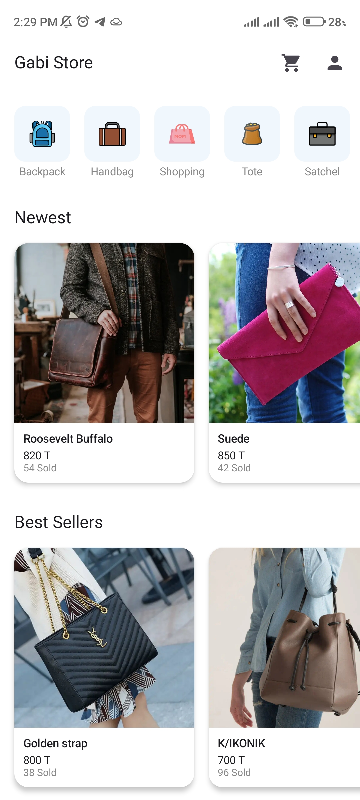
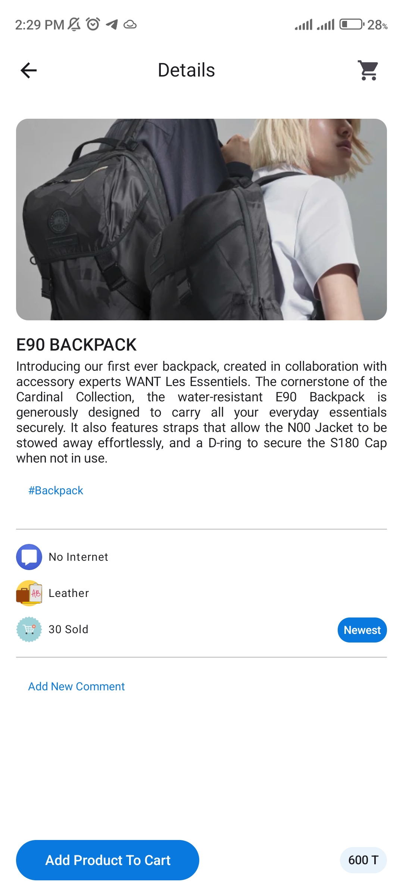
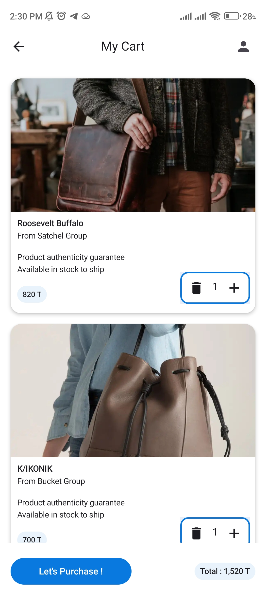

# Gabi Store 🛍️

A modern, feature-rich **e-commerce app** for Android built with **Kotlin** and **Jetpack Compose**. Gabi Store lets users browse products, manage carts, check out, and view their profile — with offline support and a responsive UI.

<p align="left">
  <a href="https://kotlinlang.org/"></a>
  <a href="https://developer.android.com/jetpack/compose"></a>
  <a href="./LICENSE"></a>
</p>

---

## ✨ Features

- **User Authentication:** secure sign-up/sign-in.
- **Product Browsing:** list with name, image, price, description.
- **Categories:** filter products by category.
- **Product Details:** full information for a single product.
- **Shopping Cart:** add/remove items, view totals.
- **Checkout:** simple, intuitive flow.
- **User Profile:** email, address, last login time.
- **Comments:** users can add comments to products.
- **Offline Support:** Room cache for previously loaded data.
- **Responsive UI:** scales across phones & orientations.

---

## 🛠️ Tech Stack

- **Language:** Kotlin
- **UI:** Jetpack Compose, Material 3
- **Async:** Coroutines, Flow
- **DI:** Koin
- **Networking:** Retrofit + OkHttp
- **Persistence:** Room
- **Images:** Coil
- **Animation:** Lottie
- **Build:** Gradle (KTS)

---

## 📐 Architecture

- **Layered/Clean-ish** approach with `ui`, `model`, and `repository` layers.
- **Unidirectional data flow** using `ViewModel` + `State` in Compose.
- **Repository pattern** bridging **Retrofit** (remote) and **Room** (local cache).

---

## 🚀 Getting Started

### Prerequisites
- **Android Studio** (Giraffe/Flamingo+ recommended)
- **JDK 17**
- **Android Gradle Plugin** compatible with your Gradle wrapper
- **Android SDK 24+**

### Installation

1) **Clone**
```bash
git clone https://github.com/ShervinKazemi/g-store.git
cd g-store
````

2. **Open** the project in Android Studio.

3. **Sync/Build** to download dependencies.

4. **Run** on an emulator or a physical device.

> Tip: for a production-like run use a **release** build:

```bash
./gradlew assembleRelease
```
## 📱 Usage

1. **Sign up** or **Sign in**.
2. **Browse** products; filter by **category**.
3. Tap a product to view **details**.
4. **Add to cart**, then **checkout**.
5. Manage your **profile**.
6. Optionally **comment** on products.

---

## 📁 Project Structure

```
g-store/
├── app/
│   ├── src/
│   │   ├── main/
│   │   │   ├── java/com/example/gabistore/
│   │   │   │   ├── di/
│   │   │   │   ├── model/
│   │   │   │   │   ├── data/
│   │   │   │   │   ├── db/
│   │   │   │   │   ├── net/
│   │   │   │   │   └── repository/
│   │   │   │   ├── ui/
│   │   │   │   │   ├── features/
│   │   │   │   │   └── theme/
│   │   │   │   └── util/
│   │   │   └── res/
│   │   └── AndroidManifest.xml
│   ├── build.gradle.kts
│   └── proguard-rules.pro
├── build.gradle.kts
└── settings.gradle.kts
```
---

## 🧰 Development Tips

* Prefer **Immutable** UI state objects for Compose.
* Use **Paging** for large product lists (optional).
* Cache images with **Coil** to reduce network load.
* For offline-first, source of truth = **Room**; sync via **Retrofit**.

---

## 🐞 Troubleshooting

* **Gradle/AGP mismatch**: align Gradle wrapper + AGP versions in `gradle/wrapper/gradle-wrapper.properties` and `build.gradle.kts`.
* **Java version**: ensure **JDK 17** is selected in **Project Structure**.
* **Network errors**: verify `BASE_URL`, Internet permission in `AndroidManifest.xml`:

```xml
<uses-permission android:name="android.permission.INTERNET" />
```

* **Compose preview not rendering**: use latest Compose + Android Studio, invalidate caches if needed.

---

## 📸 Screenshots

<div style="display: flex; justify-content: space-between; gap: 10px;">
  
  
  
</div>
